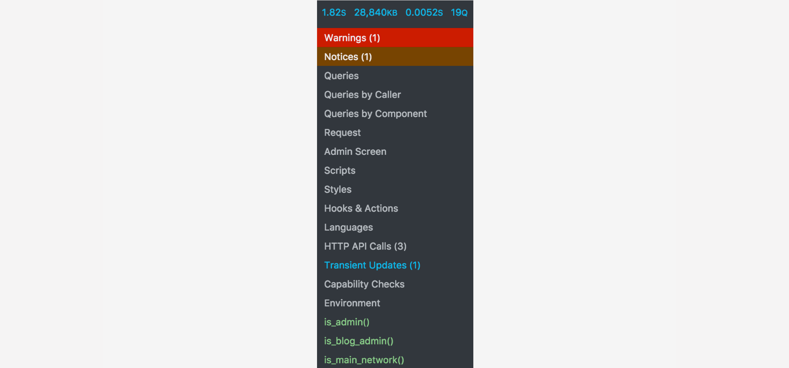
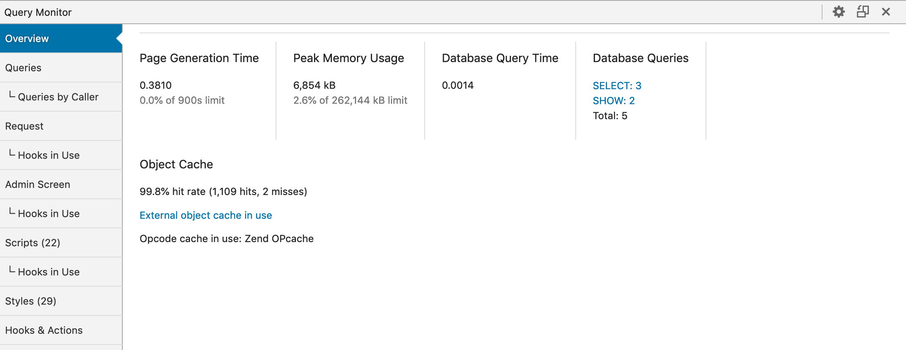
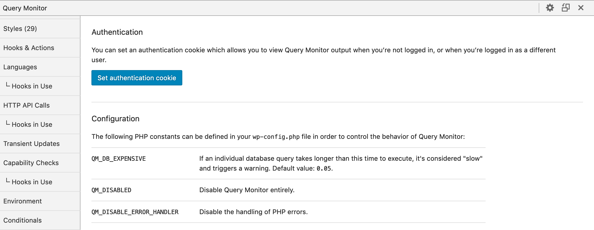

# Developer Tools

Altis includes developer tools to allow you to debug and optimise your code. They provide you with an overview of how your page was rendered, as well as details on the various components.

The Altis developer tools are built on top of the [Query Monitor](https://querymonitor.com/) plugin.

## Getting started

The developer tools are active by default for all environment types except `production`. While logged in, a summary of the request's details will appear in the toolbar at the top of the page. Click this summary to open the developer tools.

This summary will automatically change colour if errors or warnings are detected on your page.

The developer tools will be displayed as a panel at the bottom of your page.

### Activating for other users

By default, only administrators have access to the developer tools. You can temporarily test with other users or while logged out by setting an activation cookie instead.

To activate this cookie, open the developer tools while logged in as an administrator, then click on the gear icon in the top right to access the settings screen. Click the "Set authentication cookie" button to enable developer tools for your browser, then switch to another account or log out.

You can also add the `view_query_monitor` capability to users to permanently grant them the ability to use the developer tools.

### Activating in other environments

You can enable this on other environments by setting the `altis.modules.dev-tools.enabled` configuration option to true. We recommend using [environment-specific configuration](docs://getting-started/configuration.md#environment-specific-configuration) to only enable it on environments where necessary, as it has a small performance cost.
