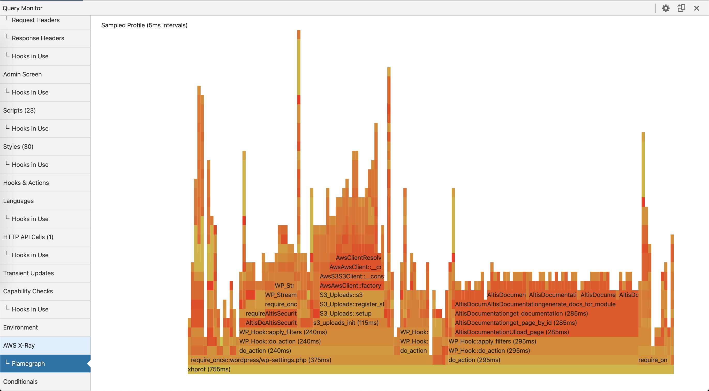

# Flamegraphs

To help in identifying performance bottlenecks and slow performing functions, Developer Tools includes a CPU time [flamegraph](http://www.brendangregg.com/flamegraphs.html) of the current page's execution. Open the Altis Developer Tools and navigate to the "Xray -> Flamegraph" panel.

The flamegraph shows execution time along the X axis. The vertical axis displays the call-depth of the PHP stack at that point in time. The flamegraph can tell you very quickly what is using the most time in the current page generation. Items in the flamegraph as clickable to zoom-in on the specific call.

Flamegraphs are generated with the [XHProf PHP extension](https://www.php.net/manual/en/book.xhprof.php), using sampling mode. The sampling interval is set to 5 milliseconds. This is considered the "resolution" of the performance profile, so you should not consider anything taking 5ms or faster to be accurately represented in the flamegraph.
