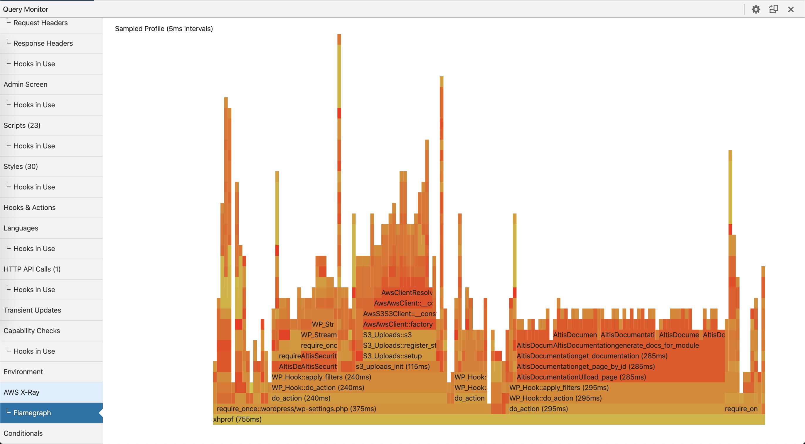

# Flame Graphs

To help in identifying performance bottlenecks and slow performing functions, Developer Tools includes a CPU
time [flame graph](http://www.brendangregg.com/flamegraphs.html) of the current page's execution. Open the Altis Developer Tools and
navigate to the "AWS X-Ray -> Flame graph" panel.

The flame graph shows execution time along the X axis. The vertical axis displays the call-depth of the PHP stack at that point in
time. The flame graph can quickly tell you what is using the most time in the current page generation. Items in the flame graph
are clickable to zoom-in on the specific call. To zoom back out again click on a function below the one currently zoomed into.

Flame graphs are generated with the [Excimer PHP extension](https://www.mediawiki.org/wiki/Excimer), using sampling mode. The
sampling interval is set to 5 milliseconds. This is considered the "resolution" of the performance profile, so you should not
consider anything taking 5ms or less to be accurately represented in the flame graph.
